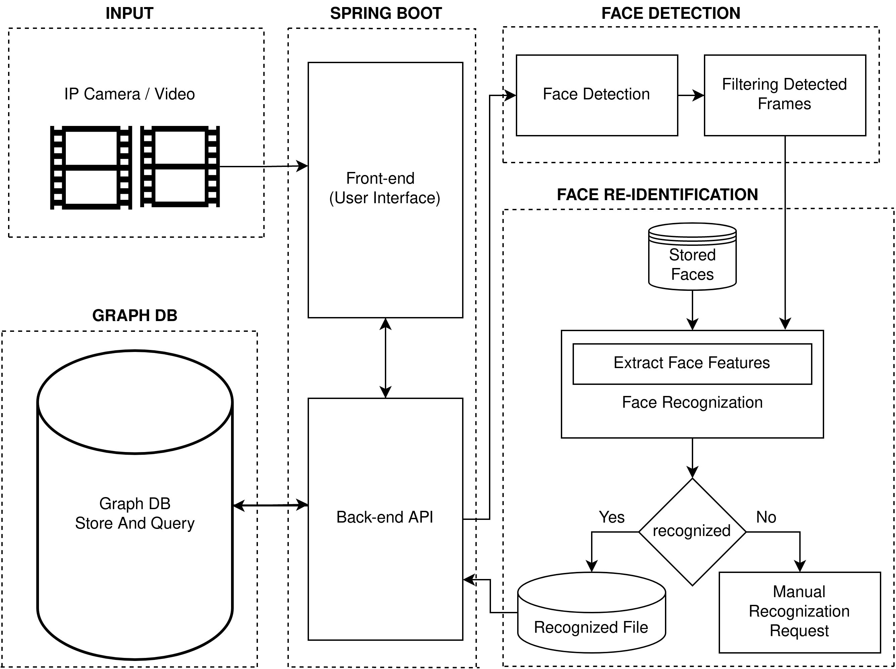

# Face_Reid_Surveillance_System

Near Real-Time Face-reIdentification Surveillance System Pipeline

<div align="center">
  
</div>


# Install latest version of docker
 - [Install Docker](docs/install_docker/README.md) - if Docker not installed on your machine yet
 - [Ensure your linux user is in the group docker](https://docs.docker.com/install/linux/linux-postinstall/)

# Download vitis-ai docker
```
docker pull xilinx/vitis-ai:1.4.1.978 
```

# Clone this repository
```bash
git clone --recurse-submodules https://github.com/durgabhavaniv/Face_Reid_Surveillance_System.git

cd Face_Reid_Surveillance_System
```

# VCK5000 setup 
 - Download below files from, https://www.xilinx.com/member/vck5000.html#vitis, and follow below commads
   - xrt_202020.2.9.317_20.04-amd64-xrt.deb
   - xilinx-vck5000-es1-gen3x16-platform-2-1_all.deb.tar.gz
   - xilinx-vck5000-es1-gen3x16-2-202020-1-dev_1-3123623_all.deb
 
```bash
sudo apt-get insall ./xrt_202020.2.9.317_20.04-amd64-xrt.deb

tar -xzvf xilinx-vck5000-es1-gen3x16-platform-2-1_all.deb.tar.gz

cd ./xilinx-vck5000-es1-gen3x16-platform-2-1_all.deb/

sudo apt-get install ./xilinx-*

cd ..

sudo apt-get install ./xilinx-vck5000-es1-gen3x16-2-202020-1-dev_1-3123623_all.deb

cd ~/Face_Reid_Surveillance_System/setup/vck5000

source ./install.sh
```

# Run docker for VCK5000
```bash
cd Face_Reid_Surveillance_System

./docker_run.sh xilinx/vitis-ai:1.4.1.978
```

# Update the stored faces data
```
cd ~/Face_Reid_Surveillance_System/demo/Vitis-AI-Library/stored_faces/
```

# Follow below setup commands inside docker
```bash
sudo apt-get update

sudo apt-get install libcanberra-gtk-module -y

source /workspace/setup/vck5000/setup.sh

sudo mkdir /usr/share/vitis_ai_library/models

cd /workspace/demo/Vitis-AI-Library/samples/reid

sudo cp reid /usr/share/vitis_ai_library/models -r

cd /workspace/demo/Vitis-AI-Library/samples/facedetect

sudo cp densebox_640_360 /usr/share/vitis_ai_library/models -r
```

# Rebuilding face reidentification in your system incase of cpp binaries are not supported.
```bash
cd /workspace/demo/Vitis-AI-Library/samples/reid

bash -x build.sh

cd /workspace/demo/Vitis-AI-Library/samples/facedetect

sudo cp ./demo.hpp /usr/include/vitis/ai/demo.hpp

bash -x build.sh
```

# Run person reidentification demo via CLI using following commads
```bash
./run.sh /workspace/demo/Vitis-AI-Library/input/Gate.mp4 &
./run.sh /workspace/demo/Vitis-AI-Library/input/Hall_entry.mp4 &
./run.sh /workspace/demo/Vitis-AI-Library/input/Room_entry.mp4 &
./run.sh /workspace/demo/Vitis-AI-Library/input/Room_exit.mp4 &
./run.sh /workspace/demo/Vitis-AI-Library/input/Hall_exit.mp4
```

# Results via CLI
 - ~/Face_Reid_Surveillance_System/demo/Vitis-AI-Library/output this directory givens the deetcted faces results.
 - ~/Face_Reid_Surveillance_System/demo/Vitis-AI-Library/output/output.txt gives results of tracking of person faces with respect to camera number and time.

# System requirements
 - os version - Ubuntu 20.04 LTS
 - kernel version - 5.4.0-52-generic

# Complete description of this project
 - Use below link
https://www.hackster.io/honeygo/near-real-time-face-reidentification-surveillance-system-d16eaf#toc-let-s-get-start-with-face-reidentification-surveillance-system-10
